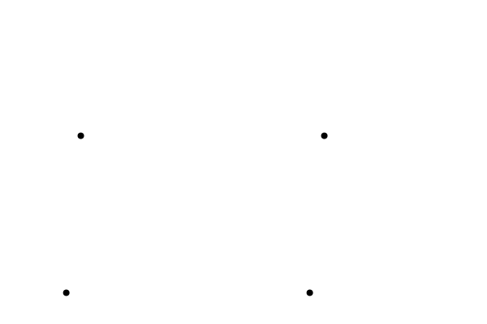
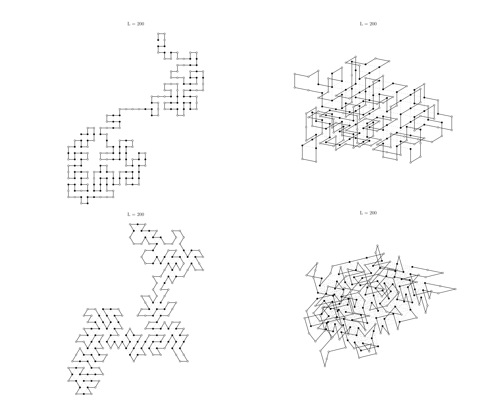
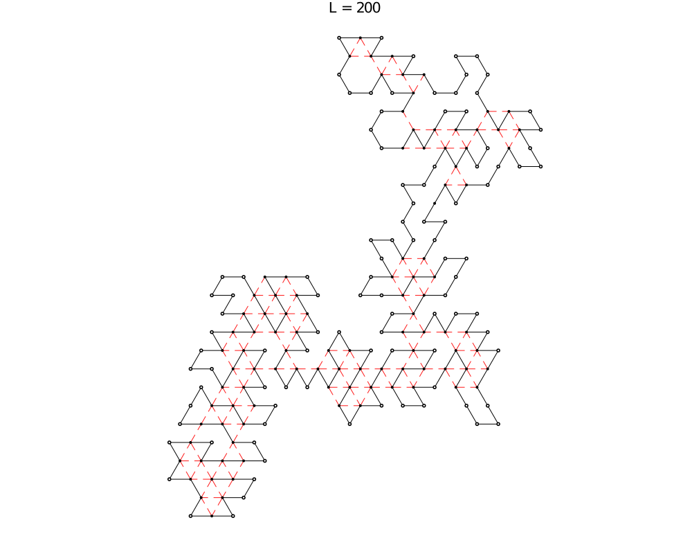
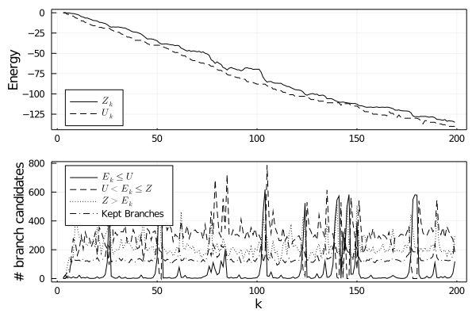

# Proteins

This is the working implementation of the Branch and Bound HP lattice protein folding algorithm developed by [Chen and Huang](https://www.brown.edu/Research/Istrail_Lab/_proFolding/papers/2005/bran-06.pdf). The general gist of all HP protein folding algorithms is:
1. Given a linear sequence of amino acids, first convert each acid to either a Hydrophobic (H) or Hydrophilic (P) type acid. Since these proteins are in aqueous solutions, the protein chain will want to fold such that the H acids are as far away from the exterior environment as possible (ie the H acids will tend to clump towards the center of the folded protein).
2. This can be equivalently thought of as maximizing the number of H acids that are adjacent to each other *excluding* consecutive H acids along the chain.
3. The negative number of these adjacent pairs can be thought of as the total energy state of the protein.
4. The allowable locations for each of these acids are bound to the vertices of a desired grid, typically square or triangular. 
5. No two acids can be on the same vertex at the same time.

The algorithm proposed by Chen and Huang implements a Branch-and-Bound growing search technique. Each acid in the chain is placed consecutively, and the energy state is compared to the historic average and historic minimum of all potential chain conformations of the same length. Their paper shows a 2D square lattice implementation, and uses a depth-first search technique. A big drawback of the depth-first implementation, is that not all conformations of length *k* are evaluated for their low-energy potential at the same time--the potential for a given partial conformation can not be fully evaluated until all possible branches from this partial conformation is completed. 

This implementation uses a *breadth*-first search technique, which evaluates *layers* of the protein chain: in other words, it tests all possible conformations of length k, evaluates each energy potential, and then begins a search for branches of length k+1 only using high-potential partial chains. This has sped up the implementation significantly. Another implementation is the 2D triangular lattice, as well as 3-Dimensional implementations of the square and triangular lattice shapes. Here are some examples on a 200-acid long chain with the sequence: `HHPPHPHPHHPHPHPHHHPPHHHPPPHHHPPHHPHPHHHPPPHPHHHPPPPPHHHHHHHPPHHPHPHHPHPHHHHPHPHHHPHPHHPHPHHHPPHPHHHHPPPPHHPHPHPPHPHHPPHHPPPPHHHPPPHPPPHPPPPPPHHHPPHHPPHHHHPPPHHPHPPPHPHPHHPHHPPPPPPPHHHPPHPPPHPPHPHHPPPH`

Another key implementation is an additional threshold culling routine. Even with the branch-and-bound algorithm, the number of potential candidate locations can be come too large to compute in a reasonable time. A user-adjustable threshold limit (default is 50000) is also set that maintains a reasonable amount of candidates to search from for the subsequent acid k+1. When the number of candidates exceeds this threshold, a random sample from all viable candidates of `n=threshold` is extracted, and then the typical culling probability selection functions are implemented on this selected subset. My tests have shown significant improvement in speed while maintaining near-optimum results (based on benchmark protein chains in the Chen and Huang paper).

# Use:
## Folding algorithm:
The main operation is taken by the interface function `folder`. The only required parameter is the sequence of polarities in the desired chain to fold, `folder(polarity)`. `polarity` can either be a string of H and P values (e.g. "HPPHHPPPHPHPP") or a binary array, where `H = 1` and `P = 0` (e.g. [1, 0, 0, 1, 1, 0, 1, 0]). All other parameters are set as optional keywords:

1. `ρ_1` (default = 0.8) culling probability threshold for candidates whose energy functions are worse than the global average
2. `ρ_2` (default = 0.5) culling probability threshold for candidates whose energy functions are between the global minimum and average
3. `dims` (default = 2) number of dimensions for lattice
4. `latticetype` (default = `:square`) shape of base lattice for folding. The other option is `:triangle`.
5. `sample_limit` (default = 50e3) the maximum number of candidates to pursue at each iteration
6. `stats` (default = true) output a DataFrame type of iteration-wise statistics on global energy, the number of candidates, etc.

If `stats=true`, the output is `e_min, c_min, output`, where `e_min` is the minimum energy state found, `c_min` is the array of amino acid positions of the optimal folded chain, and `output` is the DataFrame of statistics. If `stats=false`, the dataframe is omitted.

## Visualization:
The chain can be visualized by `chainvis(chain, polarity)`. `chain` is the position-vector of the solved chain (or any arbitrary chain of length = length(polarity)), and `polarity` is the polarity sequence of the chain. Optional arguments are:

1. `title` (default = true) gives the length of the chain
2. `size` (default = 6) size of the H, P node representation
3. `link` (default = true) visualize the H-H links that sum to the energy value of the conformation
   1. `linkcolor` (default = :black) color of link lines
   2. `linkalpha` (default = 0.5) alpha value of the link lines

The plotting uses the `Plots` package from Julia. Any backend can be used; the `plotlyjs()` back end is especially nice to manipulate in 3D:

The statistics of the overall optimization can be visualized using `statsvis(stats)`:

